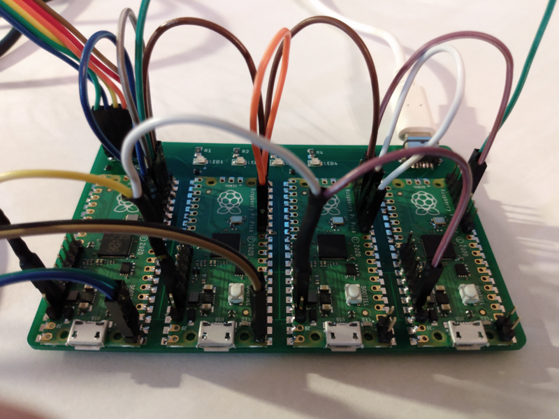

# Pico network protocol stack, physical, data link and network layers.

Physical layer

Standard 3.3 volt GPIO transmit and receive. Single transmit pin and receive pin with single wire connection. All devices share common ground.

Data link layer.

32n1 UART implemented on PIO. Packet data is serialized into 1 start bit, 32 data bits and no parity bit. The transmitter rounds messages to 32 bit word size and prepends the message size in words and the from and to addresses for transmission. Receiver expects to receive that many words. No error detection or correction is applied. The link is expected to be perfect.

Network layer

Packet routing is accomplished using a simple 4 bit node id. The nodes are organized in a unidirectional ring, and each node acts as an add-drop multiplexer. A packet received with a destination address matching the node's id it is queued on the nodes received packet queue for application retrieval. If the packet is not for his node it is transmitted to the next node in the ring. In order to achieve efficient memory management and limit the size of receive buffer a packet size limit of 1024 bytes is imposed.

